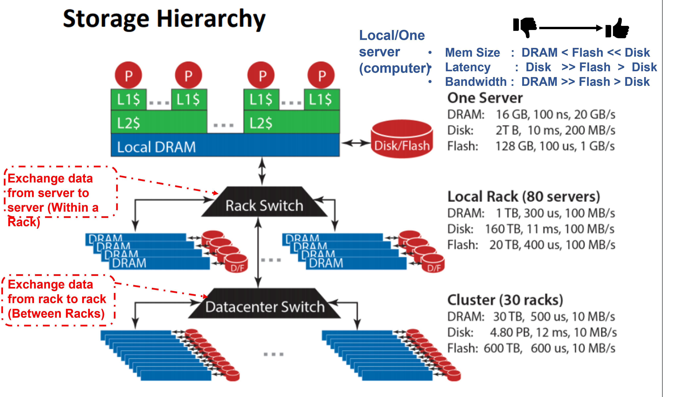
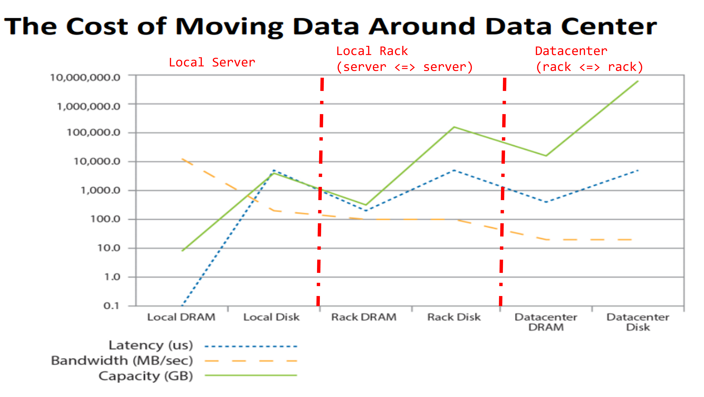
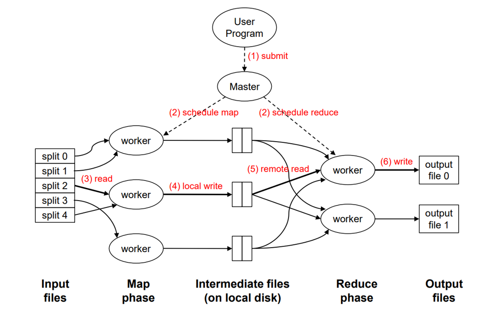
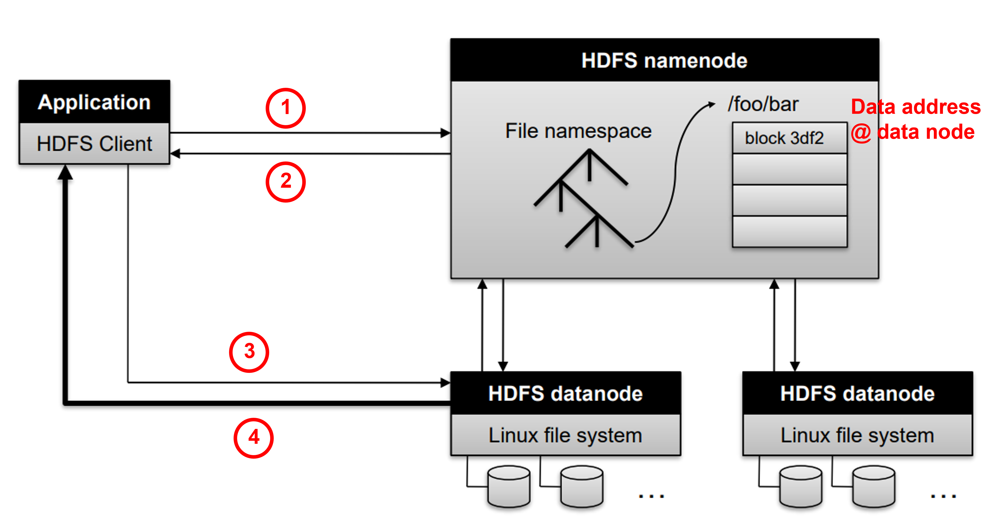

# CS5425

# lecture 1: Big data introduction

## 1. 4V's 
* Volume   : Scale of data 
* Variety  : Different forms of data
* Velocity : Analysis of streaming data
* Veracity : Uncertainty of data (e.g. mislabelled data, cleaning data)

## Data Lake: place to store massive data (Structured & Unstructured)
* Challenges:
  * **Data Discovery** : Finding datasets for analysis 
    * => Large Scale
  * **Dataset Versioning** : maintain all versions of datasets for storage cost-saving, collaboration, auditing, and experimental reproducibility. 
    * => Duplicates from different projects & update & altering the schema &  disappearing/reappearing 
  * **Data diversity** : different forms & source
* Tasks (life cycle): Metadata Management, Ingestion, Extraction, Cleaning, Integration, Discovery, Versioning

## Cloud Computing 
* Utility Computing : Pay the Computing resources according how much you need 
* Everything as a service
  * Utility computing = Infrastructure as a Service (**IaaS**)
    * Rent the machine (e.g. Amazon’s EC2, Rackspace)
  * Platform as a Service (**PaaS**)
    * Provide API & maintenance, upgrades (e.g. Google App Engine)
  * Software as a Service (**SaaS**)
    * e.g. Gmail, Salesforce

## Datacenter
### Building blocks
  * Datacenter => server racks => cluster switchs (=> servers (computers))
  * ~~~
     1 rack = 
     [   cluster switch  ]  <===========>  [   cluster switch  ]
     [ server (computer) ]                 [ server (computer) ] <=======||
     [ server (computer) ]                 [ server (computer) ] <=======||
     [ server (computer) ]                 [ server (computer) ] <==>[   rack switch  ]
     [ server (computer) ]                 [ server (computer) ] <=======||
     [        ...        ]                 [        ...        ] <=======||
  * **Switches** are used to connect multiple devices on the **same network** within the data center.
  * **Routers**, on the other hand, are used to tie **multiple networks** together.
  * **Server => Switch => Router => Internet <= Router <= Switch <= Server**
### Properties / Performance
* Bandwidth: Maximum Data / unit time (e.g. GB/s) , how fast?
* Latency: **time** taken for 1 packet to go from source to destination (one-way)  or from source to destination back to source (round trip) (e.g. ms) , how far?
* **Bandwidth vs Latency**
  * transmit **large** amount of data: bandwidth! (tells how long the transmission will take)
  * transmit **small** amount of data: latency! (tells how much delay will get the data)
### Memory / Data Access

#### Local Server (Data transmited within computer) Compares
* Hardware absolute comparision
    * Mem size : DRAM < Flash << Disk
    * Latency : Disk >> Flash > DRAM
    * Bandwidth : DRAM >> Flash > Disk

#### Compararison in Datacenter

* Latency
  * Local Disk & DRAM: locally DRAM is much faster than local disk
  * Rack DRAM: Data transmit from server to server (local Rack), take longer route than local DRAM worse than local DRAM but still better than local Disk (Disk is super slow)
  * **Rack DRAM vs(=) Datacenter DRAM**: the latency from transmission in rack and datacenter is bounded by **network latency** not the DRAM itself;
  * **local disk vs(=) rack disk vs(=) Datacenter disk**: the bottleneck is **hard disk latency** itself
*  Bandwidth
   *  Local Disk & DRAM: locally DRAM has higher bandwidth than local disk
   *  **Local** DRAM/Disk vs(>) *Rack* DRAM/Disk vs(>) **Datacenter** DRAM/Disk: The Rack/Datacenter Switch's bandwidth is shared by more and more Servers(DRAM/Disk), BW = BW_total(Switch) / #No.of servers <== getting smaller!

# 4 big ideas: Principal when analysis big data system!
## Scale Out; Not Scale Up
* Scale Up: upgrade a single computer to perform all the tasks => **Limits of SMP(symetric multi-processing) & Cost !**
* Scale Out: Distribute the task to a large number of machines combine together
## Move processing to the data
* Bandwidth Limitation: Moving data from rack/datacenter to rack/datacenter => if task is dedicated to specific machine, we have to move data to this machine (distribute the datablock)
* **Moving & Assign tasks with data**
## Process data sequentially, avoid random access
* Access the data byte by byte => Searching across racks/datacenters is costly => high latency
## Seamless Scalability
* Ideally, adding more machines, improve the performance linearly => Scale Out should work
* **Trade-off Scalability**
  * design the algos that scalable (hard?)

# Lecture 2 MapReduce
## Intros
* API
  * map (k1, v1) => f_extract() => [<k2,v2>, <k2,v2'>, ... <k2',v> ...]
  * reduce (k2, [v2,v2'...]) => f_reduce() => [<k3, v3>, ...]
* Important Assumption!: All values with **the same key** are sent to **the same reducer**
* Shuffle:
  * after map, before reduce
  * **gather** & **sort** & **aggregate** the values that belongs to the same key
  * assign the <key, [values]> to the reducers
* Partition
  * **Shuffle** by default base on hashing of the key (e.g. hash(k') mod n)
  * Customized Partition, e.g. groupby a range of the keys
* Combine:
  * in map executor, can do the local reduce => ease of the traffic in shuffle stage
* keys arrive reducer are sorted (not globally sorted)

## MapReduce Analysis

### IO
1. Hard disk IO
   * Read & write: @ R input files; R/W intermediate files & W output files 
   * Why? Trade-off **Reliability vs Performance**
2. Network IO
   * Shuffling stage: IO exchange data <= bottleneck (data from different racks)
   * Scheduling: data distribution across machine
### Distributed File System
* Move processing(Workers) to the data
  * Store data @ local disk in cluster
  * Start up worker on the node with local data
* Motivation
  * RAM capacity limitation
  * Data center network is slow (local disk vs data center disk)
  * disk access is slow, but throughput is reasonable 
* e.g.: GFS; HDFS
### GFS Assumptions & Design Decision
* Assumptions
  * Scale Out
  * High component faliure reate
  * Designed for huge files 
  * Files are write-once, mostly **appended to**
  * Sequential access over random access: Throughput is ok, Latency is disaster
* Design Decision
  * Files stored as chunks (fixed 64MB) <= **Trade off: Bandwidth vs scalable**
    * Too small: random access rathe than sequential
    * Too big: not scalable => one map response to one chuck => parallism is bad
  * Reliability through replication
    * Store same chunks in different servers (nodes) (e.g. 3+ majority vote)
  * Single master to coordinate access, keep metadata
  <!-- 
  * No data caching: data is huge, no good for caching
  * simple API -->
### HDFS Architecture & Process

#### Process
1. Client request access and process data to namenode
2. namenode send the address @ datanode that cient interest in 
3. Client receive the address form namenode and request data from datanode @ address
4. Datanode send data @ address requested to client
##### Namenode Responsibilities
* Managing the file system namespace
* Coordinating file operations
  * Directs clients to datanodes for reads and writes
  * **No data is moved through the namenode !**
* Maintaining overall health (periodically)
  * Periodic communication with the datanodes
  * Block re-replication and rebalancing
  * Garbage collection

## Performance Guidelines for Basic Algorithmic Design in MapReduce !!!!
### Linear scalability: 
* more nodes can do more work in the same time
* Linear on data size & computer resources
### Minimize the amount of I/Os in hard disk and network:
* Minimize disk I/O; sequential vs. random
* Minimize network I/O; bulk send/recvs vs. many small send/recvs (bandwidth)
### Memory working set per task / work:
* Large memory working set -> high probability of failures

